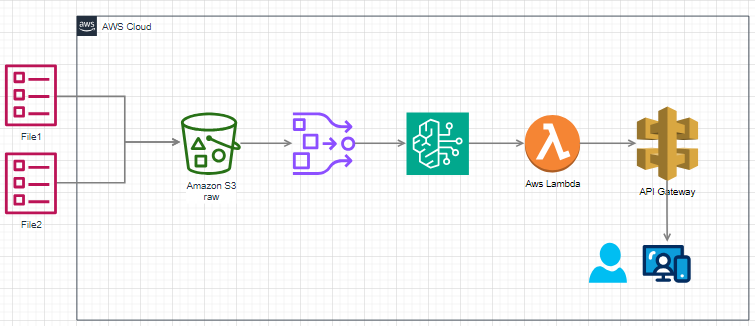

# aws-bedrock-stream-chat

# Arquitetura de IA Generativa com AWS Bedrock
Este repositório apresenta uma arquitetura de exemplo para o processamento de uma base de conhecimento em formato PDF utilizando serviços da AWS Bedrock. O diagrama abaixo ilustra o fluxo de dados, desde a ingestão do arquivo PDF até a disponibilização dos resultados por meio de uma API.

## Descrição da Arquitetura

### Knowledge Base.pdf:

Representa um arquivo PDF contendo uma base de conhecimento que será processada.
Este documento é o ponto de partida para o pipeline de processamento.

### Amazon S3 (Bucket Raw):

O arquivo PDF é armazenado em um bucket S3 para armazenamento inicial.
Este bucket serve como o repositório central para o arquivo bruto, permitindo que ele seja acessado por outros serviços AWS.

### OpenSearch:

Um serviço de busca que pode estar relacionado ao AWS OpenSearch é utilizado para indexar e buscar informações dentro do PDF.
Este componente processa o conteúdo do PDF para torná-lo pesquisável e estruturado para consultas.

### Bedrock:

O serviço AWS Bedrock é utilizado para realizar inferências ou análises avançadas no conteúdo extraído.
Bedrock pode usar modelos de inteligência artificial para interpretar o conteúdo e fornecer insights ou classificações com base no texto.

### AWS Lambda:

Uma função Lambda é usada para orquestrar a integração entre os serviços, gerenciar o fluxo de dados e processar os resultados obtidos do Bedrock.
Lambda também pode manipular os dados processados para que sejam adequados para apresentação via API.

### API Gateway:

O API Gateway expõe uma API que permite que sistemas externos ou usuários consultem o conteúdo processado ou os resultados de análises realizadas no PDF.
Os usuários podem realizar buscas ou acessar dados específicos do documento através de chamadas HTTP.

### Usuários Finais:

Representa os usuários ou sistemas que interagem com a API para acessar o conteúdo processado da base de conhecimento.
Eles podem utilizar uma interface de usuário ou outro sistema automatizado para enviar consultas e visualizar os resultados.

## Como Usar
Upload de PDF:

Carregue o arquivo PDF da base de conhecimento no bucket S3 designado.
Processamento Automatizado:

O pipeline automatizado processará o PDF, tornando-o pesquisável e analisável.
Consultas via API:

Utilize o endpoint fornecido pelo API Gateway para enviar consultas e acessar os resultados processados.
Requisitos
AWS S3
AWS Lambda
AWS Bedrock
OpenSearch
API Gateway
AWS IAM para controle de acesso e permissões

## Informações e links
terraform apply -auto-approve -var-file="./_variables/prd.tfvars"
terraform plan -var-file="./_variables/prd.tfvars"
terraform destroy -auto-approve -var-file="./_variables/prd.tfvars"

Testar a API:
https://web.postman.co/workspace/My-Workspace~8f1e3737-b1ba-4ab9-8b11-35e197089d68/history/37802722-d9d6f6fa-01a2-4553-ace6-a08c4651f6a9

https://serverlessland.com/patterns/lambda-bedrock-response-streaming

https://github.com/aws-samples/serverless-patterns/tree/main/lambda-bedrock-response-streaming

Build a ChatGPT on AWS in 17 Minutes | Bedrock, Lambda, API Gateway
https://www.youtube.com/watch?v=aMAmD-1SFYQ

https://github.com/AWS-Cloud-Drops-Builders-Edition/show

#1: Como integrar modelos fundacionais ao seu código com Amazon Bedrock [vídeo] OK

