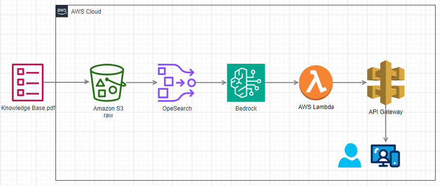

# aws-bedrock-stream-chat
aws-bedrock-stream-chat

## Comandos
terraform apply -auto-approve -var-file="./_variables/prd.tfvars"
terraform plan -var-file="./_variables/prd.tfvars"
terraform destroy -auto-approve -var-file="./_variables/prd.tfvars"

Testar a API:
https://web.postman.co/workspace/My-Workspace~8f1e3737-b1ba-4ab9-8b11-35e197089d68/history/37802722-d9d6f6fa-01a2-4553-ace6-a08c4651f6a9

https://serverlessland.com/patterns/lambda-bedrock-response-streaming

https://github.com/aws-samples/serverless-patterns/tree/main/lambda-bedrock-response-streaming

Build a ChatGPT on AWS in 17 Minutes | Bedrock, Lambda, API Gateway
https://www.youtube.com/watch?v=aMAmD-1SFYQ

https://github.com/AWS-Cloud-Drops-Builders-Edition/show

#1: Como integrar modelos fundacionais ao seu código com Amazon Bedrock [vídeo] OK

